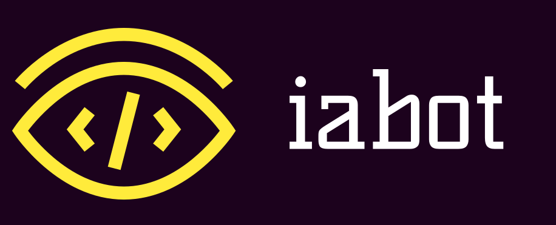

# iabot
<!-- PROJECT SHIELDS -->
[![Contributors][contributors-shield]][contributors-url]
[![Forks][forks-shield]][forks-url]
[![Stargazers][stars-shield]][stars-url]
[![Issues][issues-shield]][issues-url]
[![MIT License][license-shield]][license-url]


<!-- PROJECT LOGO -->
<br />
<p align="center">
  <a href="https://github.com/mystacx/iabot">
    
  </a>

  <h3 align="center">IABot</h3>

  <p align="center">
    Trying out my python to develop a discord for use on a community discord. Main focus is to be able to repeatedly warn people to check messages, provide reminders, and whatever else I think of.
    <br />
    <a href="https://github.com/mystacx/iabot"><strong>Explore the docs »</strong></a>
    <br />
    <br />
    <a href="https://github.com/mystacx/iabot/issues">Report Bug</a>
    ·
    <a href="https://github.com/mystacx/iabot/issues">Request Feature</a>
  </p>
</p>


<!-- TABLE OF CONTENTS -->
<details open="open">
  <summary><h2 style="display: inline-block">Table of Contents</h2></summary>
  <ol>
    <li>
      <a href="#about-the-project">About The Project</a>
      <ul>
        <li><a href="#built-with">Built With</a></li>
      </ul>
    </li>
    <li>
      <a href="#getting-started">Getting Started</a>
      <ul>
        <li><a href="#prerequisites">Prerequisites</a></li>
        <li><a href="#installation">Installation</a></li>
      </ul>
    </li>
    <li><a href="#usage">Usage</a></li>
    <li><a href="#roadmap">Roadmap</a></li>
    <li><a href="#contributing">Contributing</a></li>
    <li><a href="#license">License</a></li>
    <li><a href="#contact">Contact</a></li>
    <li><a href="#acknowledgements">Acknowledgements</a></li>
  </ol>
</details>


<!-- ABOUT THE PROJECT -->
## About The Project

[![Product Name Screen Shot][product-screenshot]](https://example.com)


### Built With

* [Python](https://www.python.org)
* [Discord](https://discord.com)


<!-- GETTING STARTED -->
## Getting Started

To get a local copy up and running follow these simple steps.

### Prerequisites

This is an example of how to list things you need to use the software and how to install them.
* npm
  ```sh
  npm install npm@latest -g
  ```

### Installation

1. Clone the repo
   ```sh
   git clone https://github.com/mystacx/iabot.git
   ```
2. Install NPM packages
   ```sh
   npm install
   ```


<!-- USAGE EXAMPLES -->
## Usage

Use this space to show useful examples of how a project can be used. Additional screenshots, code examples and demos work well in this space. You may also link to more resources.

_For more examples, please refer to the [Documentation](https://example.com)_


<!-- ROADMAP -->
## Roadmap

See the [open issues](https://github.com/mystacx/iabot/issues) for a list of proposed features (and known issues).


<!-- CONTRIBUTING -->
## Contributing

Contributions are what make the open source community such an amazing place to be learn, inspire, and create. Any contributions you make are **greatly appreciated**.

1. Fork the Project
2. Create your Feature Branch (`git checkout -b feature/AmazingFeature`)
3. Commit your Changes (`git commit -m 'Add some AmazingFeature'`)
4. Push to the Branch (`git push origin feature/AmazingFeature`)
5. Open a Pull Request


<!-- LICENSE -->
## License

Distributed under the MIT License. See `LICENSE` for more information.


<!-- CONTACT -->
## Contact

Project Link: [https://github.com/mystacx/iabot](https://github.com/mystacx/iabot)


<!-- ACKNOWLEDGEMENTS -->
## Acknowledgements

* []()
* []()
* []()


<!-- MARKDOWN LINKS & IMAGES -->
<!-- https://www.markdownguide.org/basic-syntax/#reference-style-links -->
[contributors-shield]: https://img.shields.io/github/contributors/mystacx/repo.svg?style=for-the-badge
[contributors-url]: https://github.com/mystacx/iabot/graphs/contributors
[forks-shield]: https://img.shields.io/github/forks/mystacx/repo.svg?style=for-the-badge
[forks-url]: https://github.com/mystacx/iabot/network/members
[stars-shield]: https://img.shields.io/github/stars/mystacx/repo.svg?style=for-the-badge
[stars-url]: https://github.com/mystacx/iabot/stargazers
[issues-shield]: https://img.shields.io/github/issues/mystacx/repo.svg?style=for-the-badge
[issues-url]: https://github.com/mystacx/iabot/issues
[license-shield]: https://img.shields.io/github/license/mystacx/repo.svg?style=for-the-badge
[license-url]: https://github.com/mystacx/iabot/blob/master/LICENSE.txt
